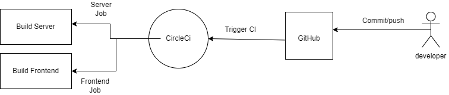

## continuous integration

github
Developers are committed to pushing their code to the CircleCI-linked GitHub repository. GitHub runs the CircleCI platform when code is pushed into the repository.

Circle
CircleCI reads the .circleci/config.yml file that tells the service what to do. In the case of Udagram, there are two jobs (front end and server) to be run by CircleCI.

Frontend: Runs the build script given in the package.json file. It then uses the AWS CLI to upload the assets to S3.
Server: Runs the build script, exports all environment variables from the CircleCI configuration to an .env file, and then runs the archive script. It then uses the AWS CLI to upload the archive to S3.